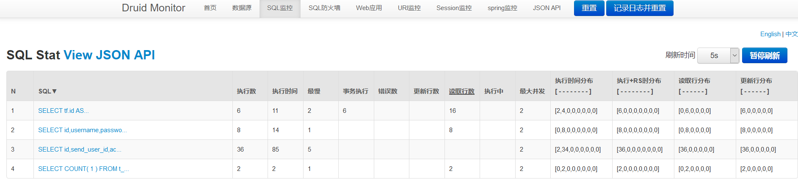
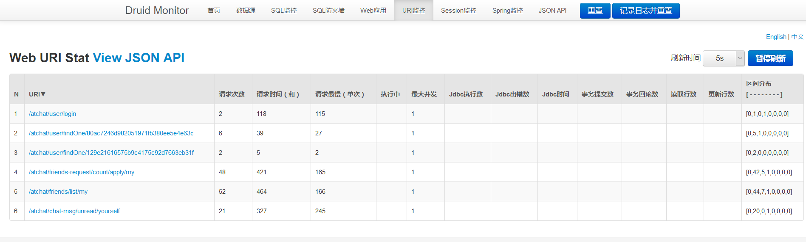
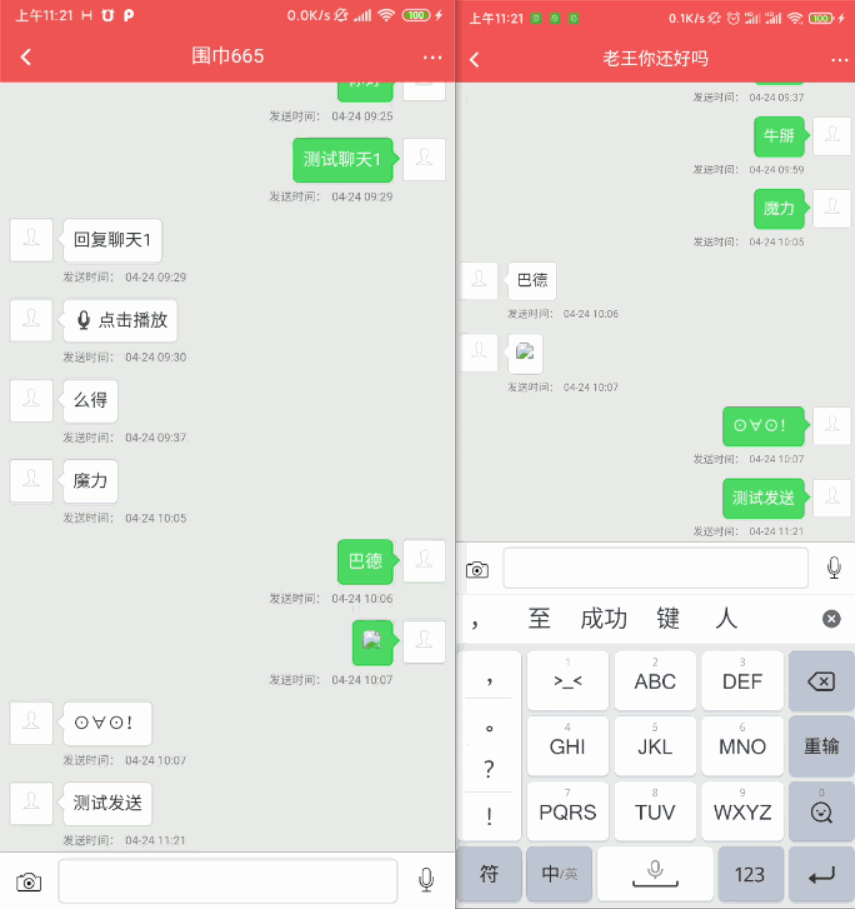

# 即时聊天

## 介绍

一个简单的即时聊天项目，前端暂未开源，可以实现加好友，图片、文本、语音消息聊天等功能

缓存使用本地缓存，Redis相关配置被我清除了

头像设置则使用单机版FastDFS

聊天过程中的音频和图片会上传至MinIo文件服务器

FastDFS和Minio文章末尾有安装方式


### 启动运行

下载：`git clone 项目`

运行和编译环境： `Maven` `IDEA` `JDK1.8`

服务：安装`FastDFS`和`Minio`，文末有安装方式

配置：

需要修改`test`配置文件

```properties
# 数据库连接修改
spring.datasource.url=jdbc:mysql://localhost:3306/atchat?useUnicode=true&characterEncoding=UTF-8&autoReconnect=true&serverTimezone=Asia/Shanghai
spring.datasource.username=
spring.datasource.password=

# tracker服务器地址列表，需要修改
fdfs.tracker-list[0]=192.168.123.233:22122

# MinIo文件服务器，需要修改
min.io.endpoint=http://your.endpoint
min.io.accessKey=your_key
min.io.secretKey=your_secret
min.io.bucketName=your_bucketName
```

数据库：

导入`doc/sql/atchat.sql`文件


### 技术选型

SpringBoot

MyBatisPlus

Mysql

Druid

Redis

Netty

DingTalk

FastDFS

Minio

ELasticSearch

RabbitMQ

...

文件存储，可以自行去集成OSS（反正也不贵）；项目里面有两种存储方式，其中Minio是后面刚好接触，顺便在业务层集成了它


### 项目结构

```shell
.
|-- AtchatApplication.java
|-- FastDFSBoot.java # fastDFS客户端
|-- NettyBoot.java # netty服务启动
|-- advance # 扩展异常
|-- annotation # 自定义注解
|-- cache # 本地缓存
|-- config # 配置文件
|-- constant # 常量
|-- controller # 接口
|-- mapper # 持久化
|-- model # 模型
|-- netty # netty的处理器
|-- service # 服务
|-- task # 定时任务
`-- util # 工具

```


### 监控






### 聊天效果




### 待开发事项

- [ ] 前端重构
  
  - [ ] uniapp
- [ ] 后端重构
  - [ ] Netty集群
  - [ ] 微服务架构

- [ ] 业务功能

  - [ ] JWT

  - [ ] 群聊、群组

  - [ ] 聊天记录搜索

  - [ ] 其他推送渠道

    

### FastDFS和Minio安装

#### FastDFS

使用docker安装，[详细文章](https://hub.docker.com/repository/docker/xuux/fastdfs)

FASTDFS_IPADDR 指定主机IP

```shell
docker run -d --restart=always \
-e FASTDFS_IPADDR=192.168.1.234 \
-v /fastdfs/data:/home/dfs \
-p 22122:22122 \
-p 23000:23000 \
-p 8888:8888  \
-p 8011:80 \
--name fastdfs xuux/fastdfs:alpine
```

需要修改宿主机路由

`iptables -t nat -A POSTROUTING -p tcp -m tcp --dport 22122 -d 172.17.0.2 -j SNAT --to 192.168.1.234`

#### Minio

使用docker安装，[官网](https://docs.min.io/docs/minio-docker-quickstart-guide.html)