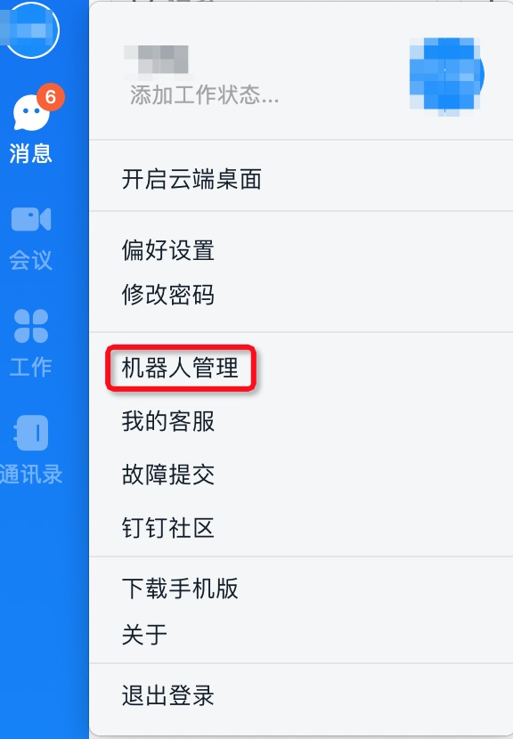
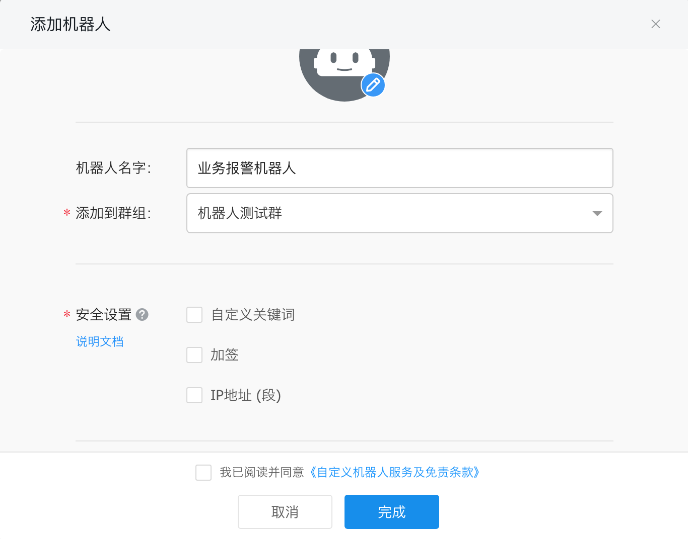
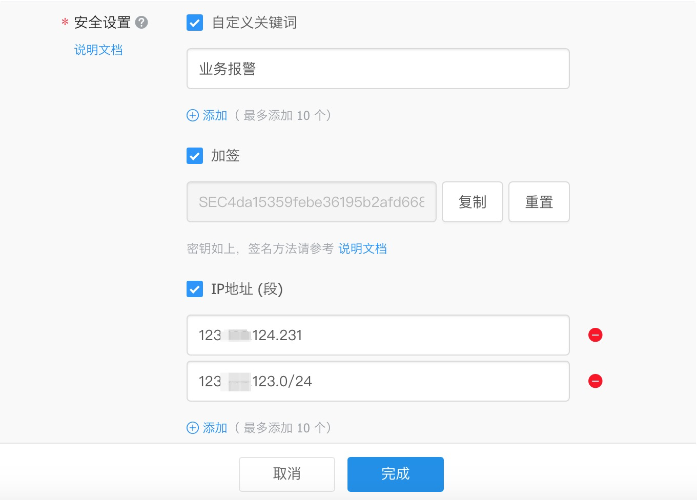
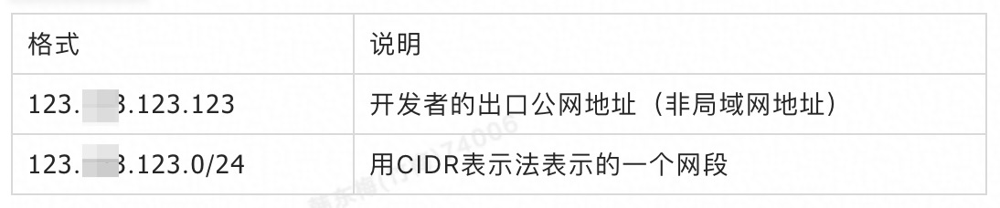
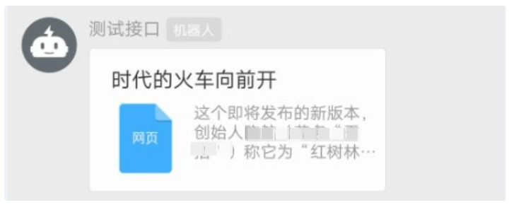
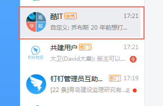
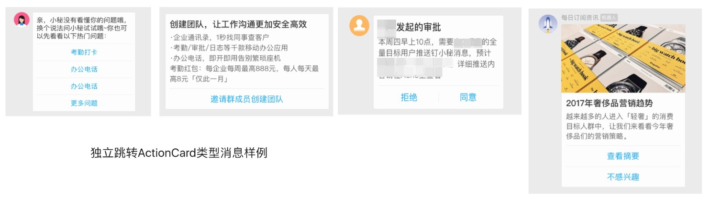

# 获取自定义机器人webhook

步骤一，打开机器人管理页面。以PC端为例，打开PC端钉钉，点击头像，选择“机器人管理”。




步骤二，在机器人管理页面选择“自定义”机器人，输入机器人名字并选择要发送消息的群，同时可以为机器人设置机器人头像。





步骤三，完成必要的安全设置（至少选择一种），勾选 我已阅读并同意《自定义机器人服务及免责条款》，点击“完成”。安全设置目前有3种方式，设置说明见下文介绍。




步骤四，完成安全设置后，复制出机器人的Webhook地址，可用于向这个群发送消息，格式如下：


```
https://oapi.dingtalk.com/robot/send?access_token=XXXXXX
```


**注意：请保管好此Webhook 地址，不要公布在外部网站上，泄露后有安全风险。****
**

## 安全设置

安全设置目前有3种方式：

**（1）方式一，自定义关键词**

最多可以设置10个关键词，消息中至少包含其中1个关键词才可以发送成功。

例如：添加了一个自定义关键词：监控报警

则这个机器人所发送的消息，必须包含 监控报警 这个词，才能发送成功。


**（2）方****式二，加签**

第一步，把timestamp+"\n"+密钥当做签名字符串，使用HmacSHA256算法计算签名，然后进行Base64 encode，最后再把签名参数再进行urlEncode，得到最终的签名（需要使用UTF-8字符集）。


| **参数**  | **说明**                                                    |
| --------- | ----------------------------------------------------------- |
| timestamp | 当前时间戳，单位是毫秒，与请求调用时间误差不能超过1小时     |
| secret    | 密钥，机器人安全设置页面，加签一栏下面显示的SEC开头的字符串 |


签名计算代码示例（Java）

```
import javax.crypto.Mac;
import javax.crypto.spec.SecretKeySpec;
import org.apache.commons.codec.binary.Base64;
import java.net.URLEncoder;

public class Test {
    public static void main(String[] args) throws Exception {
        Long timestamp = System.currentTimeMillis();
        String secret = "this is secret";

        String stringToSign = timestamp + "\n" + secret;
        Mac mac = Mac.getInstance("HmacSHA256");
        mac.init(new SecretKeySpec(secret.getBytes("UTF-8"), "HmacSHA256"));
        byte[] signData = mac.doFinal(stringToSign.getBytes("UTF-8"));
        String sign = URLEncoder.encode(new String(Base64.encodeBase64(signData)),"UTF-8");
        System.out.println(sign);
    }

}
```


签名计算代码示例（Python）


```
#python 3.8 
import time
import hmac
import hashlib
import base64
import urllib.parse

timestamp = str(round(time.time() * 1000))
secret = 'this is secret'
secret_enc = secret.encode('utf-8')
string_to_sign = '{}\n{}'.format(timestamp, secret)
string_to_sign_enc = string_to_sign.encode('utf-8')
hmac_code = hmac.new(secret_enc, string_to_sign_enc, digestmod=hashlib.sha256).digest()
sign = urllib.parse.quote_plus(base64.b64encode(hmac_code))
print(timestamp)
print(sign)
```


```
#python 2.7
import time
import hmac
import hashlib
import base64
import urllib

timestamp = long(round(time.time() * 1000))
secret = 'this is secret'
secret_enc = bytes(secret).encode('utf-8')
string_to_sign = '{}\n{}'.format(timestamp, secret)
string_to_sign_enc = bytes(string_to_sign).encode('utf-8')
hmac_code = hmac.new(secret_enc, string_to_sign_enc, digestmod=hashlib.sha256).digest()
sign = urllib.quote_plus(base64.b64encode(hmac_code))
print(timestamp)
print(sign)
```


第二步，把 timestamp和第一步得到的签名值拼接到URL中。

| **参数**  | **说明**             |
| --------- | -------------------- |
| timestamp | 第一步使用到的时间戳 |
| sign      | 第一步得到的签名值   |


```
https://oapi.dingtalk.com/robot/send?access_token=XXXXXX&timestamp=XXX&sign=XXX
```


**（3）方****式三，IP地址（段）**

设定后，只有来自IP地址范围内的请求才会被正常处理。支持两种设置方式：IP、IP段，暂不支持IPv6地址白名单，格式如下:




**注意：安全设置的上述三种方式，需要****至少****设置其中一种，以进行安全保护**。校验不通过的消息将会发送失败，错误如下：

```
// 消息内容中不包含任何关键词
{
  "errcode":310000,
  "errmsg":"keywords not in content"
}

// timestamp 无效
{
  "errcode":310000,
  "errmsg":"invalid timestamp"
}

// 签名不匹配
{
  "errcode":310000,
  "errmsg":"sign not match"
}

// IP地址不在白名单
{
  "errcode":310000,
  "errmsg":"ip X.X.X.X not in whitelist"
}
```


# 使用自定义机器人

（1）获取到Webhook地址后，用户可以向这个地址发起HTTP POST 请求，即可实现给该钉钉群发送消息。注意，发起POST请求时，必须将字符集编码设置成UTF-8。

**（2）当前自定义机器人支持文本 (text)、链接 (link)、markdown(****markdown)、ActionCard、FeedCard消息类型**，大家可以根据自己的使用场景选择合适的消息类型，达到最好的展示样式。

（3）自定义机器人发送消息时，可以通过手机号码指定“被@人列表”。在“被@人列表”里面的人员收到该消息时，会有@消息提醒(免打扰会话仍然通知提醒，首屏出现“有人@你”)。

**（4）当前机器人尚不支持应答机制** (该机制指的是群里成员在聊天@机器人的时候，钉钉回调指定的服务地址，即Outgoing机器人)。


**SDK ：**

可以下载[SDK](https://ding-doc.dingtalk.com/doc#/faquestions/vzbp02)，简化调用方式。


**消息发送频率限制：**

每个机器人每分钟最多发送20条。消息发送太频繁会严重影响群成员的使用体验，大量发消息的场景 (譬如系统监控报警) 可以将这些信息进行整合，通过markdown消息以摘要的形式发送到群里。


# 测试自定义机器人

> 通过下面方法，可以快速验证自定义机器人是否可以正常工作：

使用命令行工具curl。

为避免出错，将以下命令逐行复制到命令行，需要将xxxxxxxx替换为真实access_token；若测试出错，请检查复制的命令是否和测试命令一致，多特殊字符会报错。

```shell
curl 'https://oapi.dingtalk.com/robot/send?access_token=xxxxxxxx' \
   -H 'Content-Type: application/json' \
   -d '{"msgtype": "text","text": {"content": "我就是我, 是不一样的烟火"}}'
```

**SDK请求示例（JAVA）：**

```java
DingTalkClient client = new DefaultDingTalkClient("https://oapi.dingtalk.com/robot/send?access_token=566cc69da782ec******");
OapiRobotSendRequest request = new OapiRobotSendRequest();
request.setMsgtype("text");
OapiRobotSendRequest.Text text = new OapiRobotSendRequest.Text();
text.setContent("测试文本消息");
request.setText(text);
OapiRobotSendRequest.At at = new OapiRobotSendRequest.At();
at.setAtMobiles(Arrays.asList("132xxxxxxxx"));
// isAtAll类型如果不为Boolean，请升级至最新SDK
at.setIsAtAll(true);
request.setAt(at);

request.setMsgtype("link");
OapiRobotSendRequest.Link link = new OapiRobotSendRequest.Link();
link.setMessageUrl("https://www.dingtalk.com/");
link.setPicUrl("");
link.setTitle("时代的火车向前开");
link.setText("这个即将发布的新版本，创始人xx称它为红树林。而在此之前，每当面临重大升级，产品经理们都会取一个应景的代号，这一次，为什么是红树林");
request.setLink(link);

request.setMsgtype("markdown");
OapiRobotSendRequest.Markdown markdown = new OapiRobotSendRequest.Markdown();
markdown.setTitle("杭州天气");
markdown.setText("#### 杭州天气 @156xxxx8827\n" +
        "> 9度，西北风1级，空气良89，相对温度73%\n\n" +
        "> \n"  +
        "> ###### 10点20分发布 [天气](http://www.thinkpage.cn/) \n");
request.setMarkdown(markdown);
OapiRobotSendResponse response = client.execute(request);
```

**PHP程序测试：**

```php
<?php  
function request_by_curl($remote_server, $post_string) {  
    $ch = curl_init();  
    curl_setopt($ch, CURLOPT_URL, $remote_server);
    curl_setopt($ch, CURLOPT_POST, 1); 
    curl_setopt($ch, CURLOPT_CONNECTTIMEOUT, 5); 
    curl_setopt($ch, CURLOPT_HTTPHEADER, array ('Content-Type: application/json;charset=utf-8'));
    curl_setopt($ch, CURLOPT_POSTFIELDS, $post_string);  
    curl_setopt($ch, CURLOPT_RETURNTRANSFER, true);  
    // 线下环境不用开启curl证书验证, 未调通情况可尝试添加该代码
    // curl_setopt ($ch, CURLOPT_SSL_VERIFYHOST, 0); 
    // curl_setopt ($ch, CURLOPT_SSL_VERIFYPEER, 0);
    $data = curl_exec($ch);
    curl_close($ch);                
    return $data;  
}  

$webhook = "https://oapi.dingtalk.com/robot/send?access_token=xxxxxx";
$message="我就是我, 是不一样的烟火";
$data = array ('msgtype' => 'text','text' => array ('content' => $message));
$data_string = json_encode($data);

$result = request_by_curl($webhook, $data_string);  
echo $result;
?>
```

# 消息类型及数据格式

## text类型

```json
{
    "msgtype": "text", 
    "text": {
        "content": "我就是我, 是不一样的烟火@156xxxx8827"
    }, 
    "at": {
        "atMobiles": [
            "156xxxx8827", 
            "189xxxx8325"
        ], 
        "isAtAll": false
    }
}
```


| **参数**  | **参数类型** | **必须** | **说明**                                    |
| --------- | ------------ | -------- | ------------------------------------------- |
| msgtype   | String       | 是       | 消息类型，此时固定为：text                  |
| content   | String       | 是       | 消息内容                                    |
| atMobiles | Array        | 否       | 被@人的手机号（在content里添加@人的手机号） |
| isAtAll   | Boolean      | 否       | 是否@所有人                                 |


## link类型

```json
{
    "msgtype": "link", 
    "link": {
        "text": "这个即将发布的新版本，创始人xx称它为红树林。而在此之前，每当面临重大升级，产品经理们都会取一个应景的代号，这一次，为什么是红树林", 
        "title": "时代的火车向前开", 
        "picUrl": "", 
        "messageUrl": "https://www.dingtalk.com/s?__biz=MzA4NjMwMTA2Ng==&mid=2650316842&idx=1&sn=60da3ea2b29f1dcc43a7c8e4a7c97a16&scene=2&srcid=09189AnRJEdIiWVaKltFzNTw&from=timeline&isappinstalled=0&key=&ascene=2&uin=&devicetype=android-23&version=26031933&nettype=WIFI"
    }
}
```


| **参数**   | **参数类型** | **必须** | **说明**                       |
| ---------- | ------------ | -------- | ------------------------------ |
| msgtype    | String       | 是       | 消息类型，此时固定为：link     |
| title      | String       | 是       | 消息标题                       |
| text       | String       | 是       | 消息内容。如果太长只会部分展示 |
| messageUrl | String       | 是       | 点击消息跳转的URL              |
| picUrl     | String       | 否       | 图片URL                        |




## markdown类型

```json
{
     "msgtype": "markdown",
     "markdown": {
         "title":"杭州天气",
         "text": "#### 杭州天气 @150XXXXXXXX \n> 9度，西北风1级，空气良89，相对温度73%\n> \n> ###### 10点20分发布 [天气](https://www.dingtalk.com) \n"
     },
      "at": {
          "atMobiles": [
              "150XXXXXXXX"
          ],
          "isAtAll": false
      }
 }
```


| **参数**  | **类型** | **必选** | **说明**                                 |
| --------- | -------- | -------- | ---------------------------------------- |
| msgtype   | String   | 是       | 此消息类型为固定markdown                 |
| title     | String   | 是       | 首屏会话透出的展示内容                   |
| text      | String   | 是       | markdown格式的消息                       |
| atMobiles | Array    | 否       | 被@人的手机号（在text内容里要有@手机号） |
| isAtAll   | Boolean  | 否       | 是否@所有人                              |


说明：目前只支持md语法的子集，具体支持的元素如下：

```json
标题
# 一级标题
## 二级标题
### 三级标题
#### 四级标题
##### 五级标题
###### 六级标题

引用
> A man who stands for nothing will fall for anything.

文字加粗、斜体
**bold**
*italic*

链接
[this is a link](http://name.com)

图片


无序列表
- item1
- item2

有序列表
1. item1
2. item2
```

## 整体跳转ActionCard类型

```json
{
    "actionCard": {
        "title": "乔布斯 20 年前想打造一间苹果咖啡厅，而它正是 Apple Store 的前身", 
        "text": " 
 ### 乔布斯 20 年前想打造的苹果咖啡厅 
 Apple Store 的设计正从原来满满的科技感走向生活化，而其生活化的走向其实可以追溯到 20 年前苹果一个建立咖啡馆的计划", 
        "btnOrientation": "0", 
        "singleTitle" : "阅读全文",
        "singleURL" : "https://www.dingtalk.com/"
    }, 
    "msgtype": "actionCard"
}
```


| **参数**       | **类型** | **必须** | **说明**                                        |
| -------------- | -------- | -------- | ----------------------------------------------- |
| msgtype        | String   | 是       | 此消息类型为固定actionCard                      |
| title          | String   | 是       | 首屏会话透出的展示内容                          |
| text           | String   | 是       | markdown格式的消息                              |
| singleTitle    | String   | 是       | 单个按钮的标题。(设置此项和singleURL后btns无效) |
| singleURL      | String   | 是       | 点击singleTitle按钮触发的URL                    |
| btnOrientation | String   | 否       | 0-按钮竖直排列，1-按钮横向排列                  |

通过整体跳转ActionCard类型消息发出的消息样式如下：



## 独立跳转ActionCard类型

```json
{
    "actionCard": {
        "title": "乔布斯 20 年前想打造一间苹果咖啡厅，而它正是 Apple Store 的前身", 
        "text": " 
 ### 乔布斯 20 年前想打造的苹果咖啡厅 
 Apple Store 的设计正从原来满满的科技感走向生活化，而其生活化的走向其实可以追溯到 20 年前苹果一个建立咖啡馆的计划", 
        "btnOrientation": "0", 
        "btns": [
            {
                "title": "内容不错", 
                "actionURL": "https://www.dingtalk.com/"
            }, 
            {
                "title": "不感兴趣", 
                "actionURL": "https://www.dingtalk.com/"
            }
        ]
    }, 
    "msgtype": "actionCard"
}
```


| **参数**       | **类型** | **必须** | **说明**                       |
| -------------- | -------- | -------- | ------------------------------ |
| msgtype        | String   | 是       | 此消息类型为固定actionCard     |
| title          | String   | 是       | 首屏会话透出的展示内容         |
| text           | String   | 是       | markdown格式的消息             |
| btns           | Array    | 是       | 按钮                           |
| └title         | String   | 是       | 按钮标题                       |
| └actionURL     | String   | 是       | 点击按钮触发的URL              |
| btnOrientation | String   | 否       | 0-按钮竖直排列，1-按钮横向排列 |

通过独立跳转ActionCard类型消息发出的消息样式如下：



## FeedCard类型

```json
{
    "feedCard": {
        "links": [
            {
                "title": "时代的火车向前开", 
                "messageURL": "https://www.dingtalk.com/s?__biz=MzA4NjMwMTA2Ng==&mid=2650316842&idx=1&sn=60da3ea2b29f1dcc43a7c8e4a7c97a16&scene=2&srcid=09189AnRJEdIiWVaKltFzNTw&from=timeline&isappinstalled=0&key=&ascene=2&uin=&devicetype=android-23&version=26031933&nettype=WIFI", 
                "picURL": "https://gw.alicdn.com/tfs/TB1ayl9mpYqK1RjSZLeXXbXppXa-170-62.png"
            },
            {
                "title": "时代的火车向前开2", 
                "messageURL": "https://www.dingtalk.com/s?__biz=MzA4NjMwMTA2Ng==&mid=2650316842&idx=1&sn=60da3ea2b29f1dcc43a7c8e4a7c97a16&scene=2&srcid=09189AnRJEdIiWVaKltFzNTw&from=timeline&isappinstalled=0&key=&ascene=2&uin=&devicetype=android-23&version=26031933&nettype=WIFI", 
                "picURL": "https://gw.alicdn.com/tfs/TB1ayl9mpYqK1RjSZLeXXbXppXa-170-62.png"
            }
        ]
    }, 
    "msgtype": "feedCard"
}
```


| **参数**   | **类型** | **必须** | **说明**                 |
| ---------- | -------- | -------- | ------------------------ |
| msgtype    | String   | 是       | 此消息类型为固定feedCard |
| title      | String   | 是       | 单条信息文本             |
| messageURL | String   | 是       | 点击单条信息到跳转链接   |
| picURL     | String   | 是       | 单条信息后面图片的URL    |

通过FeedCard类型消息发出的消息样式如下：

